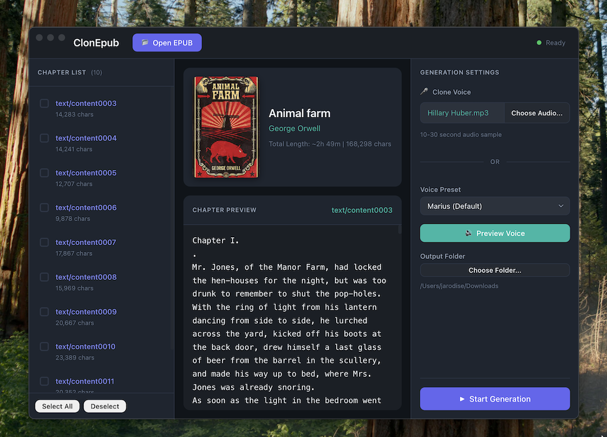

# ClonEpub 🎧

Convert EPUB e-books to high-quality audiobooks with voice cloning. A standalone Electron app powered by Pocket TTS — runs on any computer, **no GPU required**.



## ✨ Features

- 📖 **EPUB to Audiobook** — Load any EPUB file and convert it to a high-quality audiobook
- 🎤 **Voice Cloning** — Clone any voice from a 10-30 second audio sample
- 🔊 **Built-in Voice Presets** — 8 ready-to-use voices with different styles
- 💻 **CPU-Only** — Runs efficiently on any modern CPU, no GPU required
- ⚡ **Fast Generation** — ~6x real-time speed on Apple Silicon, ~200ms latency for first chunk
- 🖥️ **Standalone App** — Self-contained Electron app with bundled Python backend
- 📥 **Auto Model Download** — TTS model downloads automatically on first run
- 🎯 **Modern UI** — Beautiful dark-themed interface with chapter selection

## 🚀 Powered by Pocket TTS

ClonEpub uses **[Pocket TTS](https://github.com/kyutai-labs/pocket-tts)** by Kyutai Labs — a lightweight, state-of-the-art text-to-speech engine:

| Feature | Details |
|---------|---------|
| **Model Size** | 100M parameters (~240 MB download) |
| **Memory** | ~1.1 GB RAM |
| **Speed** | ~6x real-time on MacBook Air M4 |
| **Latency** | ~200ms to first audio chunk |
| **CPU Cores** | Uses only 2 CPU cores |
| **Voice Cloning** | Clone any voice from a short audio sample |

## 📦 Installation

### Option 1: Download Pre-built App (Recommended)

1. Go to the [Releases](https://github.com/jarodise/ClonEpub-Pocket/releases) page
2. Download the `.dmg` file for macOS
3. Open the DMG and drag ClonEpub to your Applications folder
4. Launch ClonEpub — models will download automatically on first run

> **⚠️ macOS Gatekeeper Warning**: If you see *"ClonEpub is damaged and can't be opened"*, run this command in Terminal:
> ```bash
> xattr -cr /Applications/ClonEpub.app
> ```
> This removes the quarantine flag that macOS adds to unsigned apps.

### Option 2: Build from Source

#### Requirements

- **Node.js** 18+ (for Electron)
- **Python** 3.10-3.12
- **uv** (Python package manager)

#### Steps

```bash
# Clone the repository
git clone https://github.com/jarodise/ClonEpub-Pocket.git
cd ClonEpub-Pocket

# Install Python dependencies
uv sync

# Build and run Electron app
cd electron
npm install
npm run start
```

#### Building a Distributable

```bash
cd electron
npm run make
```

This creates a `.dmg` file in `electron/out/make/`.

## 🎯 Usage

### Basic Workflow

1. **Open EPUB** — Click "Open EPUB" to load your e-book
2. **Select Chapters** — Use the chapter list to select which chapters to convert
3. **Choose Voice** — Select a voice preset or upload your own audio sample for cloning
4. **Preview** — Click "Preview Voice" to hear a sample
5. **Generate** — Click "Start Generation" to create your audiobook

### Voice Cloning Tips

For best results with custom voice cloning:

- Use a **10-30 second** clear audio sample
- **Single speaker** only, minimal background noise
- **Clear enunciation** works best
- **WAV or MP3** format supported

### Built-in Voice Presets

| Voice | Description |
|-------|-------------|
| Marius (Default) | Male, neutral tone |
| Alba | Female, warm and expressive |
| Javert | Male, authoritative |
| Jean | Male, soft spoken |
| Fantine | Female, gentle |
| Cosette | Female, bright |
| Eponine | Female, dramatic |
| Azelma | Female, youthful |

## 🔧 Technical Details

### Tech Stack

- **TTS Engine**: [Pocket TTS](https://github.com/kyutai-labs/pocket-tts) (PyTorch, CPU-optimized)
- **Frontend**: Electron 28+
- **Backend**: Python Flask server (bundled)
- **NLP**: spaCy for sentence segmentation
- **Audio**: soundfile for WAV encoding

### First Run Downloads

On first launch, ClonEpub automatically downloads:

- **Pocket TTS Model** (~240 MB) — The TTS engine weights
- **spaCy en_core_web_sm** (~12 MB) — For sentence detection

Models are cached in `~/.cache/huggingface/` and only need to be downloaded once.

### HuggingFace Access

Voice cloning requires access to the gated `kyutai/pocket-tts` model:

1. Create a [HuggingFace account](https://huggingface.co/join)
2. Accept the license at [kyutai/pocket-tts](https://huggingface.co/kyutai/pocket-tts)
3. The app will prompt for your HuggingFace token if needed

## ⚠️ Prohibited Use

> **Important**: This application uses the Pocket TTS model which has usage restrictions.

Use of this application and the underlying model must comply with all applicable laws and regulations and must not result in, involve, or facilitate any illegal, harmful, deceptive, fraudulent, or unauthorized activity.

**Prohibited uses include, without limitation:**

- Voice impersonation or cloning without explicit and lawful consent
- Misinformation, disinformation, or deception (including fake news, fraudulent calls, or presenting generated content as genuine recordings of real people or events)
- Generation of unlawful, harmful, libelous, abusive, harassing, discriminatory, hateful, or privacy-invasive content

**We disclaim all liability for any non-compliant use.**

## 🙏 Credits

- **TTS Engine**: [Pocket TTS](https://github.com/kyutai-labs/pocket-tts) by Kyutai Labs
  - Authors: Manu Orsini, Simon Rouard, Gabriel De Marmiesse, Václav Volhejn, Neil Zeghidour, Alexandre Défossez
- **Inspiration**: [audiblez](https://github.com/santinic/audiblez) by Claudio Santini

## 📄 License

This project is licensed under the MIT License.

**Note**: The Pocket TTS model has its own license terms. Please review the [Pocket TTS license](https://huggingface.co/kyutai/pocket-tts) before use.
