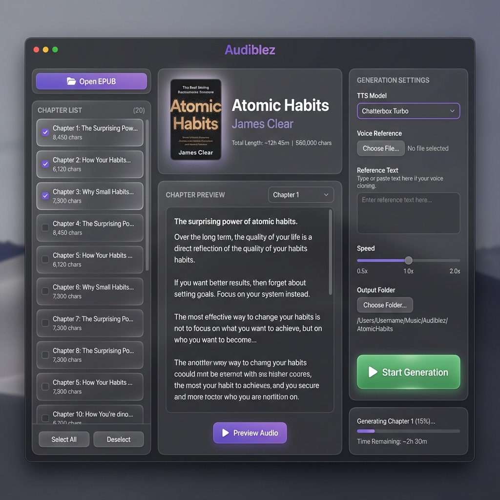

# ClonEpub 🎧

Convert EPUB e-books to high-quality audiobooks with voice cloning. Runs on any computer with Python — no GPU required.



## ✨ Features

- 🎤 **Voice Cloning** — Clone any voice from a 10-30 second audio sample
- 📚 **EPUB Support** — Load and convert standard EPUB files
- 🖥️ **Cross-Platform** — Works on macOS, Windows, and Linux
- 💻 **CPU-Only** — No GPU required, runs efficiently on any modern CPU
- 🎯 **Modern UI** — Beautiful dark-themed interface
- 📥 **Easy Setup** — Models download automatically on first run

## 🚀 Powered by Pocket TTS

ClonEpub uses **[Pocket TTS](https://github.com/reshinthadithyan/pocket-tts)** — a state-of-the-art text-to-speech engine with voice cloning capability:

| Feature | Details |
|---------|---------|
| **Model** | Based on Chatterbox architecture |
| **Memory** | ~1.1 GB RAM |
| **Speed** | ~80 minutes to generate "Animal Farm" (~30k words) |
| **Voice Cloning** | Clone any voice from a short audio sample |
| **Quality** | Natural, expressive speech with emotion preservation |

## Requirements

- Python 3.10-3.12
- ffmpeg (for audio encoding)
- Any modern CPU (Apple Silicon, Intel, AMD)

## Installation

> **Note**: This project uses [uv](https://docs.astral.sh/uv/) for Python environment management. If you don't have uv installed:
> ```bash
> curl -LsSf https://astral.sh/uv/install.sh | sh
> ```

```bash
# Clone the repository
git clone https://github.com/jarodise/ClonEpub.git
cd ClonEpub

# Create virtual environment and install dependencies
uv sync

# Run the app
uv run clonepub
```

## Usage

```bash
# Launch the GUI
uv run clonepub
```

### Voice Cloning Tips

For best results with voice cloning:
- Use a 10-30 second clear audio sample
- Single speaker, minimal background noise
- Clear enunciation works best

## First Run

On first launch, ClonEpub will download:
- **Pocket TTS Model** (~800 MB) — The TTS engine
- **spaCy en_core_web_sm** (~12 MB) — For sentence detection

Models are cached in `~/.cache/huggingface/`

## Tech Stack

- **TTS Engine**: Pocket TTS (PyTorch)
- **UI Framework**: Electron + PyWebView
- **NLP**: spaCy for sentence segmentation
- **Audio Processing**: soundfile, ffmpeg

## Credits

- TTS powered by [Pocket TTS](https://github.com/reshinthadithyan/pocket-tts)
- Inspired by [audiblez](https://github.com/santinic/audiblez) by Claudio Santini

## License

MIT License
